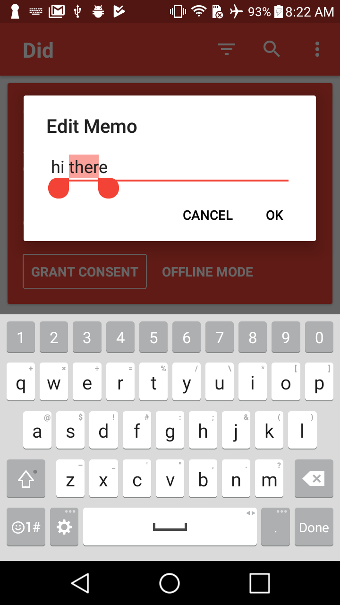

# react-native-prompt-android
A polyfill library for Alert.prompt on Android platform, working both on Android and iOS platform(iOS using [AlertIOS.prompt](http://facebook.github.io/react-native/docs/alertios.html#prompt))


### Installation

* Install from npm

```bash
npm i react-native-prompt-android --save
```

* Link native library

You can use react-native-cli:
```bash
react-native link react-native-prompt-android
```

#### Manual Linking
In case `react-native link` fails you can follow this manual linking.

1. Include this module in `android/settings.gradle`:

```
...
include ':react-native-prompt-android' // Add this
project(':react-native-prompt-android').projectDir = new File(rootProject.projectDir, '../node_modules/react-native-prompt-android/android') // Add this
...
include ':app'
```

2. Add a dependency to your app build in `android/app/build.gradle`:

```
dependencies {
   ...
   compile project(':react-native-prompt-android') // Add this
}
```

3. Change your main application to "import" and "add" a new package, in `android/app/src/main/.../MainApplication.java`:

```java
import im.shimo.react.prompt.RNPromptPackage; // Add new import

public class MainApplication extends Application implements ReactApplication {
  ...

  @Override
  protected List<ReactPackage> getPackages() {
    return Arrays.<ReactPackage>asList(
      new MainReactPackage(),
      new RNPromptPackage() // Add the package here
    );
  }
}
```

4. Re-compile application using `react-native run-android`

### Usage

```
import prompt from 'react-native-prompt-android';
prompt(
    'Enter password',
    'Enter your password to claim your $1.5B in lottery winnings',
    [
     {text: 'Cancel', onPress: () => console.log('Cancel Pressed'), style: 'cancel'},
     {text: 'OK', onPress: password => console.log('OK Pressed, password: ' + password)},
    ],
    {
        type: 'secure-text',
        cancelable: false,
        defaultValue: 'test',
        placeholder: 'placeholder'
    }
);
```

### API

#### `prompt`

###### Android
     static showPopupMenu(
         title?: string,
         message?: string,
         positiveCallbackOrButtons: ()=>void | [ButtonPositive] | [ButtonNegative, ButtonPositive] | [ButtonNeutral, ButtonNegative, ButtonPositive],
         options: {
             disableFullscreenUI?: boolean,
             cancelable?: boolean,
             type?: 'default' | 'plain-text' | 'secure-text' | 'numeric' | 'email-address' | 'phone-pad',
             defaultValue?: string,
             style?: 'default' | 'shimo' | 'cust',
             placeholder?: string,
             placeholderColor?: string,
             highlightColor?: string,
             color?: string,
             buttonColor?: string
         }
     ): void

###### iOS

TODO:

### Options
The third argument is an object. It can have any of these keys:

| Key                 | Description                                                               | Type                 | Default                                                             |
|---------------------|---------------------------------------------------------------------------|----------------------|---------------------------------------------------------------------|
| type                | Text input type: `'numeric', 'secure-text', 'phone-pad', 'email-address'` | string               | 'default'                                                           |
| cancelable          | Android only. If tapping outside of the alert box should cause dismiss.   | boolean              | true                                                                |
| defaultValue        | Default input value                                                       | string               |                                                                     |
| placeholder         | String in input that will be rendered when empty.                         | string               |                                                                     |
| style               | `'default', 'shimo', 'cust'`                                              | string               | 'default'                                                           |
| disableFullscreenUI | When in landscape mode, don't use fullscreen                              | boolean              | false                                                               |
| highlightColor      | Color of text selection                                                   | string               |  |
| placeholderColor    | Color of the placeholder in input field                                   | string               |  |
| color               | Color of the text in input field                                          | string               |  |
| buttonColor         | Color of the buttons                                                      | string               |  |
| onDismiss           | Callback triggered when prompt is dismissed                               | () => void           |                                                                     |
| onAny               | Callback triggered when any action happens                                | PromptAction => void |                                                                     |

##### "cust" Style (change underline, cursor, and handle color)
If you set this style, you can adjust the color of the "underline", "cursor", and "handles" of the input field. The default custom color is a reddish color of "#F34336". You can change this by going to `./node_modules/react-native-prompt-android/android/src/main/res/values/colors.xml` and changing the value of the `custUnderlineAndCursorAndHandleColor` field.

### Screenshots


#### Android with options

    prompt('Edit Memo', undefined,
        [
            { text:'Cancel', style:'cancel' },
            { text:'OK', onPress: text => dispatch(patchEvent(id, { memo:text })) },
        ],
        {
            highlightColor: 'rgba(243, 67, 54, 0.5)',
            color: '#212121',
            buttonColor: '#000000',
            defaultValue: memo,
            style: 'cust',
            onDismiss: () => console.log('prompt was dismissed')
            onAny: action => {
                switch(action) {
                    case prompt.dismissedAction: return console.log('onAny says dismissed');
                    case prompt.positiveAction: return console.log('onAny says positive button clicked');
                    case prompt.negativeAction: return console.log('onAny says negative button clicked');
                    case prompt.neutralAction: return console.log('onAny says neutral button clicked');
                }
            }
        }
    )

And to get the red colors, the field `custUnderlineAndCursorAndHandleColor` in `./node_modules/react-native-prompt-android/android/src/main/res/values/colors.xml` was updated to `#F34336`



